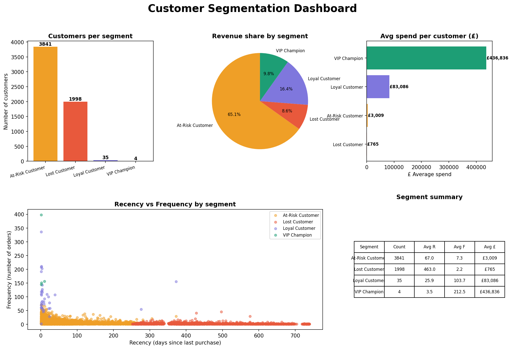

# Customer Segmentation — RFM + K-Means Clustering

A complete end-to-end data science project that segments e-commerce customers into actionable groups using **RFM analysis** and **K-Means clustering** on a real dataset of 1 million+ transactions.

---

## Dashboard Preview



---

## What This Project Does

Raw e-commerce transaction data → cleaned → RFM scored → clustered → visualised into a business dashboard.

**1,067,371 rows** of raw transactions were processed down to **5,878 unique customers**, each assigned to one of 4 segments:

| Segment | Customers | Avg Recency | Avg Orders | Avg Spend |
|---|---|---|---|---|
| VIP Champion | 4 | 4 days | 213 orders | £436,836 |
| Loyal Customer | 35 | 26 days | 104 orders | £83,086 |
| At-Risk Customer | 3,841 | 67 days | 7 orders | £3,009 |
| Lost Customer | 1,998 | 463 days | 2 orders | £765 |

---

## Key Business Insights

- **4 VIP customers** account for nearly 10% of total revenue — protect them at all costs
- **3,841 at-risk customers** represent the biggest re-engagement opportunity
- **1,998 lost customers** haven't bought in 463 days — needs a win-back campaign
- Only **39 loyal customers** — growing this segment should be a top priority

---

## Project Structure
```
customer-segmentation-rfm/
├── Data/
│   └── online_retail_II.csv        # Raw dataset (UCI Online Retail II)
├── Output/
│   ├── customer_segments.csv       # Final output — one row per customer
│   ├── dashboard.png               # 5-chart visual dashboard
│   └── elbow_curve.png             # K selection chart
├── SRC/
│   ├── load_data.py                # Load raw CSV into pandas
│   ├── preprocess.py               # Clean and prepare data
│   ├── rfm.py                      # Calculate RFM scores
│   ├── clustering.py               # K-Means clustering + labelling
│   ├── dashboard.py                # Build visualisation dashboard
│   └── main.py                     # Run full pipeline end to end
└── .gitignore
```

---

## Tech Stack

| Tool | Purpose |
|---|---|
| Python 3.11+ | Core language |
| Pandas | Data loading and transformation |
| NumPy | Numerical operations |
| Scikit-learn | K-Means clustering + StandardScaler |
| Matplotlib | Dashboard visualisation |
| Git + GitHub | Version control |

---

## How to Run

### 1. Clone the repository
```bash
git clone https://github.com/JuanJoe2003/customer-segmentation-rfm.git
cd customer-segmentation-rfm
```

### 2. Install dependencies
```bash
pip install pandas numpy matplotlib scikit-learn openpyxl
```

### 3. Add the dataset
Download the [UCI Online Retail II dataset](https://www.kaggle.com/datasets/mashlyn/online-retail-ii-uci) and place it in the `Data/` folder as `online_retail_II.csv`.

### 4. Run the full pipeline
```bash
python SRC/main.py
```

### 5. View the dashboard
```bash
python SRC/dashboard.py
```

---

## RFM Analysis Explained

- **Recency (R)** — How many days since their last purchase? Lower = better
- **Frequency (F)** — How many unique orders did they place? Higher = better
- **Monetary (M)** — How much total did they spend? Higher = better

---

## Dataset

**UCI Online Retail II** — Real UK-based online gift retailer transactions from December 2009 to December 2011.

- Source: [UCI Machine Learning Repository](https://archive.ics.uci.edu/dataset/502/online+retail+ii)
- Rows: 1,067,371
- Columns: Invoice, StockCode, Description, Quantity, InvoiceDate, Price, Customer ID, Country

---

🚀 **Live Demo:** https://customer-segmentation-rfm-6rznxvpd2kguxx6eb9ghfq.streamlit.app

---

## Author

**JuanJoe2003** — Built as a portfolio project to demonstrate end-to-end data science skills including data cleaning, feature engineering, unsupervised machine learning, and business insight communication.
